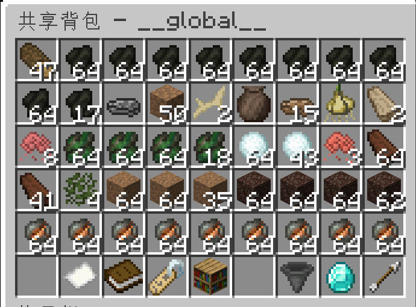

# Shared Backpack / 共享背包

[](https://fabricmc.net/)
[](https://adoptium.net/)
[](LICENSE)



A server-only Minecraft Fabric mod for 1.16.5 and 1.20.1, providing a team-shared backpack with SQLite storage, fuzzy Chinese pinyin search, and player-customizable boxes.

服务端 only 的 Minecraft Fabric 模组，支持 1.16.5 与 1.20.1，提供基于 SQLite 的团队共享背包，支持模糊拼音搜索和玩家自定义盒子。

---

## Features / 功能

- **Team backpack** — Items shared across team members; global backpack for solo players
- **Player boxes** — Personal named boxes with independent storage, managed via GUI
- **Fuzzy search** — `/c <text>` with PinIn-powered Chinese pinyin matching, English name, item ID, and namespace search (e.g. `tfc:ore`, `forge:stone`)
- **Mod classification** — Secondary menu groups items by mod namespace with representative icons
- **Unload mode** — `/cc unload` opens a blank 5-row grid for quick dumping
- **Item metadata** — HoverName shows `[Player HH:mm xN]`; stripped on item pickup
- **SQLite storage** — Auto-backup, transaction-safe, strict NBT comparison for stacking
- **Page navigation** — Diamond-based capacity upgrade; prev/next page buttons
- **Sort** — Consolidate identical items into stacks, keeping metadata

### Commands / 命令

| Command / 命令 | Description / 说明 |
|----------------|---------------------|
| `/c` | Open shared backpack / 打开共享背包 |
| `/c <search>` | Open with search filter / 打开并搜索 |
| `/cc help` | Show help / 显示帮助 |
| `/cc unload` | Unload mode (no buttons) / 卸货模式 |
| `/cc box create <name>` | Create personal box / 创建个人盒子 |
| `/cc box open <name>` | Open personal box / 打开个人盒子 |
| `/cc box list` | List your boxes / 列出盒子 |
| `/cc box delete <name>` | Delete box / 删除盒子 |
| `/cc admin info <team>` | Team info (op level 2) / 队伍信息 |
| `/cc admin upgrade <team> <pages>` | Add pages (op 2) / 升级页数 |
| `/cc admin backup` | Force DB backup (op 2) / 强制备份 |
| `/cc admin reload` | Reload DB (op 2) / 重载数据库 |
| `/cc search <query>` | Search items (op 2) / 搜索物品 |

### GUI Controls / 界面控制

Bottom row (slots 45-53) is the control bar:

| Slot | Icon | Function |
|------|------|----------|
| 45 | Arrow ◀ | Previous page / 上一页 |
| 46 | Paper | Page indicator / 页码 |
| 47 | Book | Item count / 物品总数 |
| 48 | Name Tag / Chest | Team/Box info, click for box menu / 队伍/盒子，点击管理盒子 |
| 49 | Bookshelf | Mod filter menu / 模组分类菜单 |
| 50 | Compass | Search info (if active) / 搜索信息 |
| 51 | Hopper | Sort/consolidate / 整理物品 |
| 52 | Diamond | Upgrade (+1 page, 1 diamond) / 升级背包 |
| 53 | Arrow ▶ | Next page / 下一页 |

**Click behavior:** Left click = take 1, Right click = take stack, Shift+click = quick move

## Build / 构建

```bash
cd sharedbackpack
./gradlew build -PmcVersion=1.16.5
# Output: build/libs/sharedbackpack-fabric-1.16.5-1.5.9.jar

./gradlew build -PmcVersion=1.20.1
# Output: build/libs/sharedbackpack-fabric-1.20.1-1.5.9.jar
```

### Dependencies / 依赖

- Minecraft 1.16.5: Fabric Loader 0.14.25+, Fabric API 0.42.0+1.16, Java 8+
- Minecraft 1.20.1: Fabric Loader 0.16.10+, Fabric API 0.92.11+1.20.1, Java 17+
- [SQLite JDBC 3.45.1.0](https://github.com/xerial/sqlite-jdbc)
- [PinIn 1.6.0](https://github.com/Towdium/PinIn) — Chinese pinyin matching

### Deploy / 部署

Install the matching Fabric Loader and Fabric API on the server, then copy the JAR whose Minecraft version exactly matches the server to its `mods/` folder. Stop the server before deploying. The 1.16.5 and 1.20.1 JARs are separate and must not be mixed.

## License / 许可证

MIT
